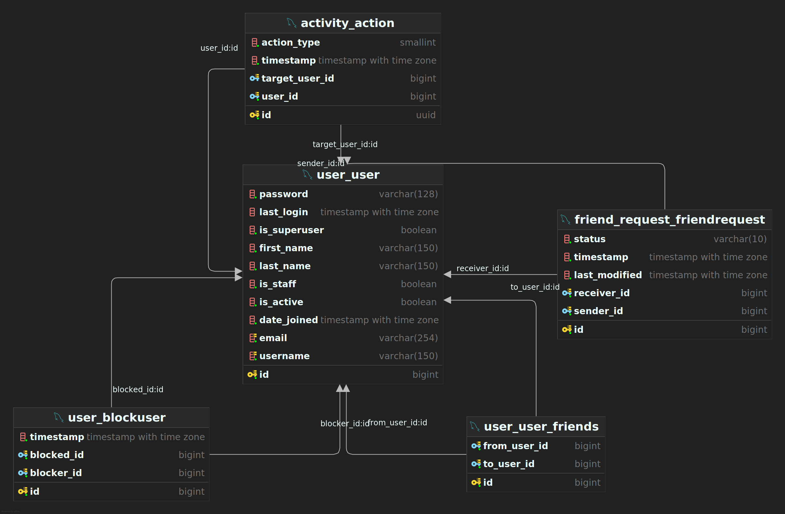

# Social Network API

This is a Django-based API project for managing user registrations, friend requests, activity logging, and other social
networking features. It uses JWT for authentication and provides functionality for user management, sending friend
requests, blocking users, and more.

## Table of Contents

1. [Technologies Used](#technologies-used)
2. [Project Features](#project-features)
3. [Installation](#installation)
4. [Running with Docker](#running-with-docker)
5. [DB Design](#db-design)
6. [API Documentation](#api-documentation)
    - [User Registration](#user-registration)
    - [User Search](#user-search)
    - [Friend Requests](#friend-requests)
    - [Blocking/Unblocking Users](#blockingunblocking-users)
    - [User Activity Logs](#user-activity-logs)

---

## Technologies Used

- **Django**: Web framework for building the API.
- **Django REST Framework (DRF)**: For building RESTful APIs.
- **PostgreSQL**: Database for storing user and social network data.
- **Redis**: Used for caching.
- **JWT (JSON Web Token)**: For handling authentication.
- **Docker**: For containerizing the application.
- **Docker Compose**: To manage multi-container Docker applications.
- **Python**: Backend programming language.

---

## Project Features

- User registration, login, and JWT-based authentication.
- Full-text search on user names using PostgreSQL.
- Friend requests (send, accept, reject).
- User blocking and unblocking.
- Activity log to keep track of user actions.
- Caching with Redis for optimized performance.

---

## Installation

### 1. Clone the Repository


```bash
git clone https://github.com/ChetanNagane/Social_Network.git
cd Social_Network
```

### 2. Set Up Virtual Environment

```bash
python3 -m venv venv
source venv/bin/activate
```

### 3. Install Dependencies

```bash
pip install -r requirements.txt
```

### 4. Configure PostgreSQL

Ensure you have PostgreSQL installed. Set up a PostgreSQL database and update your \`settings/dev.py\` with the correct
database credentials:

```python
DATABASES = {
    'default': {
        'ENGINE': 'django.db.backends.postgresql',
        'NAME': 'social_network',
        'USER': 'your_username',
        'PASSWORD': 'your_password',
        'HOST': 'localhost',
        'PORT': '5432',
    }
}
```

### 5. Migrate the Database

```bash
python manage.py migrate
```

### 6. Create Superuser

```bash
python manage.py createsuperuser
```

### 7. Run the Development Server

```bash
python manage.py runserver
```

### 8. Populate Dummy Data

To add users and establish friendships between them, run the following commands:

- Add 50,000 users(from \`sample_users.csv\`):

```bash
python manage.py add_users
```

- Establish friendships between users (this command can be run multiple times to connect more users):

```bash
python manage.py add_friendships
```

These commands will help you populate the database with dummy data for testing purposes.

---

## Running with Docker

### 1. Build and Run Docker Containers

If you prefer to use Docker, you can run the application in containers. Ensure Docker and Docker Compose are installed
on your machine.

To build and run the containers, use the following commands:

```bash
docker-compose build
docker-compose up
```

This will:

- Build the Docker image for your Django application.
- Start PostgreSQL and Redis containers.
- Run the Django development server.

To stop the containers:

```bash
docker-compose down
```

---

# DB Design



---

# API Documentation

You can test these APIs using
the [Postman Collection](https://www.postman.com/lively-star-104294/workspace/public/collection/19463239-a7f5482c-e6fc-4fc2-b4f0-ed07b9f399ee?action=share&creator=19463239)

## User Registration

**Endpoint**: `POST /api/v1/user/signup/`

Registers a new user.

**Request**:

```json
{
  "username": "john_doe",
  "password": "password123",
  "email": "john@example.com"
}
```

---

## User Login

**Endpoint**: `POST /api/v1/user/login/`

Authenticates a user and provides a JWT access token.

**Request**:

```json
{
  "email": "john@example.com",
  "password": "password123"
}
```

---

## Refresh Access Token

**Endpoint**: `POST /api/v1/user/refresh-token/`

Refreshes an expired JWT access token.

**Request**:

```json
{
  "refresh": "<refresh_token>"
}
```

---

## User Search

**Endpoint**: `GET /api/v1/user/search/?q={search_query}`

Search for users by name or email.

**Request**:

No request body is required. Pass the search query as a query parameter (`q`).

---

## Friends

### List Friends

**Endpoint**: `GET /api/v1/user/friends/`

---

## Friend Requests

### Send Friend Request

**Endpoint**: `POST /api/v1/friend-request/send/`

**Request**:

```json
{
  "receiver_id": 2
}
```

---

### Accept/Reject Friend Request

**Endpoint**: `PUT /api/v1/friend-request/{friend_request_id}/`

**Request**:

```json
{
  "action": "accepted" # or "rejected"
}
```

---

### List Pending Friend Requests

**Endpoint**: `GET /api/v1/user/friends/?o=timestamp`


---

## Blocking/Unblocking Users

### List Blocked users

List users blocked by logged in user

**Endpoint**: `GET /api/v1/user/block/`

---

### Block User

**Endpoint**: `POST /api/v1/user/block/`

**Request**:

```json
{
  "blocked_id": 2
}
```

---

### Unblock User

**Endpoint**: `DELETE /api/v1/user/unblock/{blocked_user_id}`

---

## User Activity Logs

### Get User Activity Log

**Endpoint**: `GET /api/v1/activity/?user={user_id}`

---
